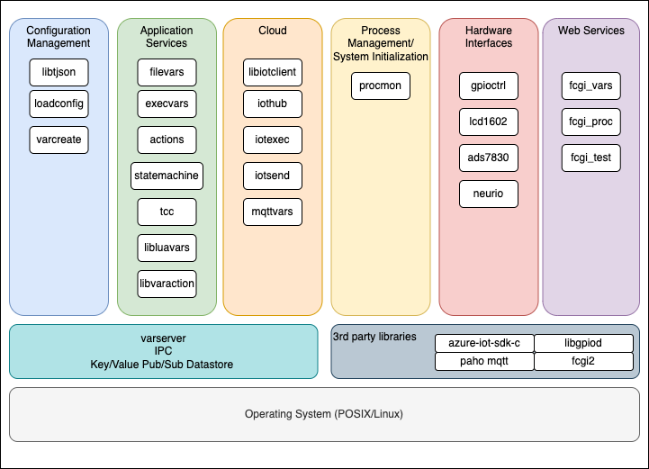

# tgp
The Gateway Project

## Overview

The Gateway Project (TGP) is a collection of loosely coupled middleware
micro-services which are building blocks for constructing a highly efficient
general purpose multi-process application solution.

The core of the gateway project is VarServer - a highly efficient
user-space publish/subscribe key/value data store which enables inter-process
communication between the otherwise loosely coupled system components.

Each component in the system can exist independently of the others. They
can be built, documented and tested independently of each other.  The only
compile-time dependency they have is the VarServer interface.

The tgp components are written in C and POSIX compliant.  They can be run
on any POSIX compliant operating system.

The Gateway Project consists of components for:

- Configuration Management
- Process Management
- Hardware Interfaces
- Web services
- Cloud interaction
- Scripting / State Machine / Actions processing

The diagram below shows the current suite of TGP components.



The Gateway Project uses the android repo project to manage
components across multiple github repositories.  To work with The
Gateway Project, install repo as described below, and pull the
code using `repo init` and `repo sync` commands as shown below.

## Installation of repo via apt

```
sudo apt-get update
sudo apt-get install repo
```

## Manual installation of repo (if apt-get does not work)

```
export REPO=$(mktemp /tmp/repo.XXXXXXXXX)
curl -o ${REPO} https://storage.googleapis.com/git-repo-downloads/repo
gpg --recv-key 8BB9AD793E8E6153AF0F9A4416530D5E920F5C65
curl -s https://storage.googleapis.com/git-repo-downloads/repo.asc | gpg --verify - ${REPO} && install -m 755 ${REPO} ~/bin/repo
```

## Check repo version

```
repo version
```

## Set up a working directory

Use whatever name you want for your working directory, but in this case
we are using 'tgp' for "The Gateway Project"

```
mkdir ~/tgp && cd ~/tgp
```

## Initialization

```
repo init -u https://github.com/tjmonk/tgp -b main
```

## Sync (download) Components

```
repo sync -c -j8
```

## Set up pre-requisite tools

```
cd tgp && ./setup.sh
```

## Build and Install everything

```
./build.sh
```

## Update the library search path
```
sudo ldconfig
```

## Create a varserver group and start the varserver
```
sudo groupadd varserver
varserver &
```

## The Gateway Project Components

The gateway project components are listed below. Click on the component name
to navigate to its github repository.

| Component | Description |
|---|---|
| [actions](https://github.com/tjmonk/actions) | Action Scripting Engine with VarServer Interface |
| [ads7830](https://github.com/tjmonk/ads7830) | ADS7830 I2C 8-bit Analog to Digital Inputs |
| [execvars](https://github.com/tjmonk/execvars) | Associate executable commands with VarServer Variables |
| [fcgi_proc](https://github.com/tjmonk/fcgi_proc) | Fast CGI Process Monitor interface |
| [fcgi_test](https://github.com/tjmonk/fcgi_test) | Fast CGI Test interface |
| [fcgi_vars](https://github.com/tjmonk/fcgi_vars) | Fast CGI interface to VarServer Variables |
| [filevars](https://github.com/tjmonk/filevars) | Associate file content with VarServer Variables |
| [gpioctrl](https://github.com/tjmonk/gpioctrl) | Associate GPIO pins with VarServer Variables |
| [iotexec](https://github.com/tjmonk/iotexec) | Remote IOT System Calls for Azure IOT Hub |
| [iothub](https://github.com/tjmonk/iothub) | Azure IOT Hub Interface |
| [iotsend](https://github.com/tjmonk/iotsend) | Send messages to Azure IOT Hub |
| [lcd1602](https://github.com/tjmonk/lcd1602) | LCD 16x2 Alphanumeric Display Interface for VarServer |
| [libiotclient](https://github.com/tjmonk/libiotclient) | Azure IOT Hub Client Library |
| [libluavars](https://github.com/tjmonk/libluavars) | Lua Interface for VarServer variables and events |
| [libtjson](https://github.com/tjmonk/libtjson) | JSON Parser using flex/bison |
| [libvaraction](https://github.com/tjmonk/libvaraction) | VarServer Actions Library for building actions parse trees |
| [loadconfig](https://github.com/tjmonk/loadconfig) | Configuration Management Utility for VarServer |
| [mqttvars](https://github.com/tjmonk/mqttvars) | VarServer MQTT Interface |
| [neurio](https://github.com/tjmonk/neurio) | Neurio Home Energy Monitor VarServer Interface |
| [procmon](https://github.com/tjmonk/procmon) | Process Monitor Service |
| [statemachine](https://github.com/tjmonk/statemachine) | Finite State Machine engine with VarServer Interface |
| [tcc](https://github.com/tjmonk/tcc) | C language Scripting and Virtual Machine with VarServer Interface |
| [tgp](https://github.com/tjmonk/tgp) | The Gateway Project (repo manifest) |
| [varcreate](https://github.com/tjmonk/varcreate) | Create Variables for the VarServer from a JSON file |
| [varserver](https://github.com/tjmonk/varserver) | Pub/Sub Key Value Store |


